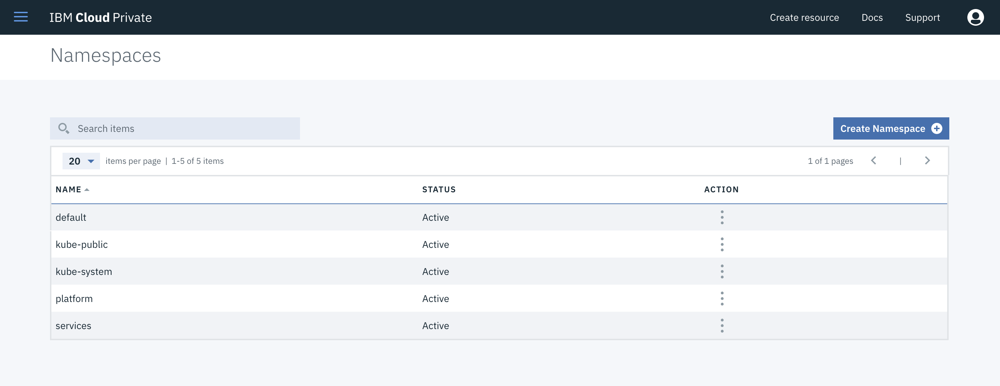
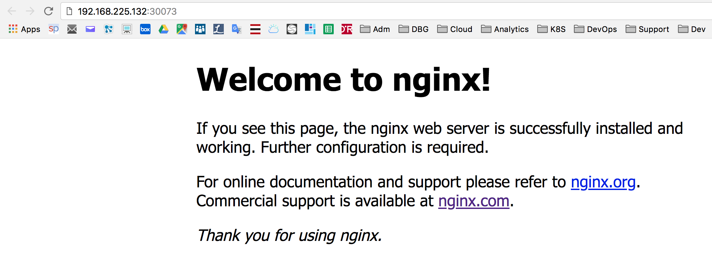
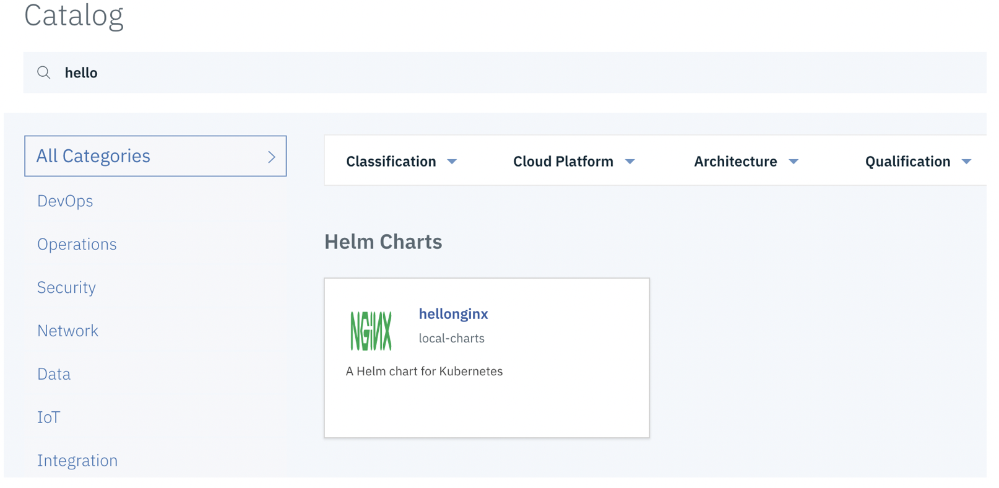
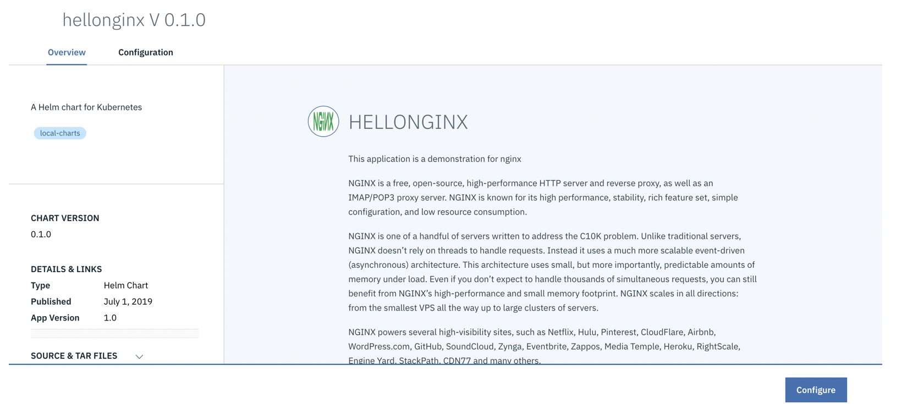
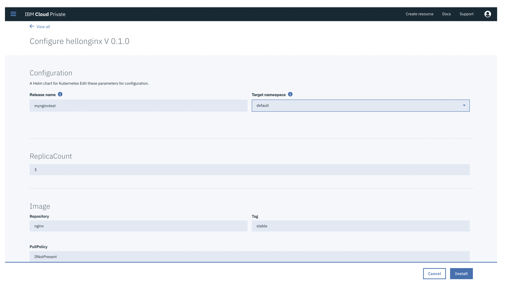

---
# Install an Application with helm Lab
---


# Prerequisites
This set of instructions requires that you have already installed ICP.

> **This lab also suppose that you already know Docker, Kubernetes and Helm.**

Before starting, login to the master node as **root**.  


# Task 1: Define a Helm chart

Now that you have understood the structure of a kubernetes manifest file, you can start working with helm chart. Basically a helm chart is a collection of manifest files that are deployed as a group. The deployment includes the ability to perform variable substitution based on a configuration file.

### 1. Check Helm

Check helm version : 

`helm version --tls`

Results:

```bash
# helm version --tls
Client: &version.Version{SemVer:"v2.12.3", GitCommit:"eecf22f77df5f65c823aacd2dbd30ae6c65f186e", GitTreeState:"clean"}
Server: &version.Version{SemVer:"v2.12.3+icp", GitCommit:"", GitTreeState:""}
```

> If you don't see the client and server version numbers or errors :
>
> - first be sure you are logged in (using the **cloudctl login** command).
> - or proceed to the helm installation (see Appendix A of this document)

Another important step is to access to the **ICP container registry**:

````
docker login $CLUSTERNAME.icp:8500 -u admin -p $CLUSTERPASS
````


Results:

```bash
# docker login mycluster.icp:8500 -u admin -p nicekkk-
WARNING! Using --password via the CLI is insecure. Use --password-stdin.
Login Succeeded
```


### 2. Create an empty chart directory

`cd`

`helm create hellonginx`

`cd hellonginx`

`yum -y install tree`

`tree .`

Results:

```bash
# tree .
.
├── charts
├── Chart.yaml
├── templates
│   ├── deployment.yaml
│   ├── _helpers.tpl
│   ├── ingress.yaml
│   ├── NOTES.txt
│   ├── service.yaml
│   └── tests
│       └── test-connection.yaml
└── values.yaml

```

Edit the value.yaml file:

`nano values.yaml`

Look at **values.yaml** and **modify it**. With nano, use **Ctrl+k** to delete a line.

Replace the **service section** and choose a port (like 30073 for instance) with the following code:

```bash
service:
  name: hellonginx-service
  type: NodePort
  externalPort: 80
  internalPort: 80
  nodePort: 30073
```

Save the file (ctrl+o, enter, crtl+x).

Review deployment template:

`nano /root/hellonginx/templates/deployment.yaml`

**Don't change anything.**

Exit the file (ctrl+x).

Then review the **service template**:
`nano /root/hellonginx/templates/service.yaml`

Change the **ports section** with the following code (don't introduce any TAB in the file and respect the indentation):

```bash
  ports:
    - port: {{ .Values.service.externalPort }}
      targetPort: {{ .Values.service.internalPort }}
      protocol: TCP
      nodePort: {{ .Values.service.nodePort }}
      name: {{ .Values.service.name }}
```


To suppress some lines, use **ctrl+k** in nano.

Save the file (ctrl+o, enter, crtl+x).


### 3. Check the chart

In the hellonginx directory, open the chart.yaml file:

`cd /root/hellonginx`

`nano Chart.yaml`

Add this line at the end of the file:

`icon: https://www.nginx.com/wp-content/uploads/2019/01/logo.svg`

The purpose of this line is to add an icon to the tile in the catalog. You can specify any sag or png file.

Save the Chart.yaml file

`helm lint`

Results:

```bash
# helm lint
==> Linting .
Lint OK

1 chart(s) linted, no failures
```


In case of error, you can :

- Analyse your change
- Check you didn't introduce any tab or cyrillic characters in the YAML files
- Check the parenthesis in the files


# Task 2 : Using Helm

The helm chart that we created in the previous section that has been verified now can be deployed.


### 1. Create a new namespace

You can use the command line to create a new namespace or you can use the IBM Cloud Private Console to do so:
- Open a  Web browser from the application launcher
- Go to `https://<masterip>:8443/`
- Login as `admin` with your password
- Go to **Menu > Manage**

  - Select __Namespaces__ then click **Create namespace**





  - Specify the namespace of `training`and `ibm-anyuid-psp`. Then click **Create**

    


### 2. Install the chart to the training namespace

Type the following command and don't forget the dot at the end:

`helm install --name hellonginx --namespace training --tls .`

Results:
```bash
# helm install --name hellonginx --namespace training --tls .
NAME:   hellonginx
LAST DEPLOYED: Thu Apr 19 23:49:47 2018
NAMESPACE: training
STATUS: DEPLOYED

RESOURCES:
==> v1beta2/Deployment
NAME        DESIRED  CURRENT  UP-TO-DATE  AVAILABLE  AGE
hellonginx  1        1        1           0          0s

==> v1/Service
NAME        TYPE      CLUSTER-IP  EXTERNAL-IP  PORT(S)       AGE
hellonginx  NodePort  10.0.0.131  <none>       80:30073/TCP  0s


NOTES:
1. Get the application URL by running these commands:
  export NODE_PORT=$(kubectl get --namespace training -o jsonpath="{.spec.ports[0].nodePort}" services hellonginx)
  export NODE_IP=$(kubectl get nodes --namespace training -o jsonpath="{.items[0].status.addresses[0].address}")
  echo http://$NODE_IP:$NODE_PORT
```


As you can see, we installed 2 Kubernetes resources : a **deployment** and a **service**.

**In case of error**, you can delete your release : `helm del --purge hellonginx —tls`

Check the pods are running in the training namespace:

`kubectl get pods -n training`

Results:

```
# kubectl get pods -n training
NAME                          READY     STATUS    RESTARTS   AGE
hellonginx-798f6d7885-vqdv4   1/1       Running   0          5m
```

You should use the following  url:
`http://ipaddress:30073`

Try this url and get the nginx hello:




### 3. List the releases

` helm list hellonginx --tls --namespace training`

Results:

```bash
# helm list hellonginx --tls --namespace training
NAME      	REVISION	UPDATED                 	STATUS  	CHART           	NAMESPACE
hellonginx	1       	Mon Oct  8 20:54:37 2018	DEPLOYED	hellonginx-0.1.0	training 
```


### 4. List the deployments

`kubectl get deployments --namespace=training`

Results:

```bash
# kubectl get deployments --namespace=training
NAME         DESIRED   CURRENT   UP-TO-DATE   AVAILABLE   AGE
hellonginx   1         1         1            1           9m
```


### 5. List the services

`kubectl get services --namespace=training`

```bash
# kubectl get services --namespace=training
NAME         TYPE       CLUSTER-IP   EXTERNAL-IP   PORT(S)        AGE
hellonginx   NodePort   10.0.0.131   <none>        80:30073/TCP   10m
```

Locate the line port 80:300073.  


### 6. List the pods

`kubectl get pods --namespace=training`

**Results**

```bash
# kubectl get pods --namespace=training
NAME                          READY     STATUS    RESTARTS   AGE
hellonginx-6bcd9f4578-zqt6r   1/1       Running   0          11m
```


### 7. Upgrade

We now want to change the number of replicas to **3** (change the **replicaCount** variable in the **values.yaml** file:

`nano values.yaml`

Change the replicas to **3** and then upgrade hellonginx:

`helm  upgrade hellonginx . --tls`

**Results**

```bash
# helm  upgrade hellonginx . --tls
Release "hellonginx" has been upgraded. Happy Helming!
LAST DEPLOYED: Fri Apr 20 00:06:55 2018
NAMESPACE: training
STATUS: DEPLOYED

RESOURCES:
==> v1/Service
NAME        TYPE      CLUSTER-IP  EXTERNAL-IP  PORT(S)       AGE
hellonginx  NodePort  10.0.0.131  <none>       80:30073/TCP  17m

==> v1beta2/Deployment
NAME        DESIRED  CURRENT  UP-TO-DATE  AVAILABLE  AGE
hellonginx  3        3        3           1          17m


NOTES:
1. Get the application URL by running these commands:
  export NODE_PORT=$(kubectl get --namespace training -o jsonpath="{.spec.ports[0].nodePort}" services hellonginx)
  export NODE_IP=$(kubectl get nodes --namespace training -o jsonpath="{.items[0].status.addresses[0].address}")
  echo http://$NODE_IP:$NODE_PORT
```

Now, look at the pods:

`kubectl get pods --namespace=training`

**Results**

```bash
# kubectl get pods --namespace=training
NAME                          READY   STATUS    RESTARTS   AGE
hellonginx-5f9568c5c5-bhp6t   1/1     Running   0          4m57s
hellonginx-5f9568c5c5-jqxwk   1/1     Running   0          28s
hellonginx-5f9568c5c5-n2k6p   1/1     Running   0          28s
```

We now have 3 pods running in the cluster. On which node are they running ?

Go to the ICP console : `https://<masterip>:8443/`

Then click on **Menu > Workload > Deployments** 

Find and click on the **hellonginx** deployment.


At the bottom of that page, find the 3 PODs and look at the IP addresses that should correspond to your different worker nodes.


### 8. Define the chart in the ICP Catalog

A good idea is to define the chart in a tile in the catalog. 

We now want to add some description to the tile in the catalog.

To do so, create a README.md file:

`nano README.md`

copy the following lines in the file:

```md
# HELLONGINX

This application is a demonstration for nginx

NGINX is a free, open-source, high-performance HTTP server and reverse proxy, as well as an IMAP/POP3 proxy server. NGINX is known for its high performance, stability, rich fea
ture set, simple configuration, and low resource consumption.

NGINX is one of a handful of servers written to address the C10K problem. Unlike traditional servers, NGINX doesn’t rely on threads to handle requests. Instead it uses a much more scalable event-driven (asynchronous) architecture. This architecture uses small, but more importantly, predictable amounts of memory under load. Even if you don’t expect to handle thousands of simultaneous requests, you can still benefit from NGINX’s high-performance and small memory footprint. NGINX scales in all directions: from the smallest VPS all the way up to large clusters of servers.

NGINX powers several high-visibility sites, such as Netflix, Hulu, Pinterest, CloudFlare, Airbnb, WordPress.com, GitHub, SoundCloud, Zynga, Eventbrite, Zappos, Media Temple, Heroku, RightScale, Engine Yard, StackPath, CDN77 and many others.
```

 

Then, package the helm chart as a tgz file:

`cd`

`helm package hellonginx`

Results:

```bash
# helm package hellonginx
Successfully packaged chart and saved it to: /root/hellonginx-0.1.0.tgz
```

**Login** to IBM Cloud Private:

```bash
cloudctl login -a https://$CLUSTERNAME.icp:8443 --skip-ssl-validation -u admin -p $CLUSTERPASS -n default
```

Then, use the **cloudctl catalog** command to load the chart:
`cloudctl catalog load-helm-chart --archive /root/hellonginx-0.1.0.tgz`

Results:

``` bash
# cloudctl catalog load-helm-chart --archive /root/hellonginx-0.1.0.tgz
Loading Helm chart
Loaded Helm chart

Synch charts on repo: local-charts
OK
```


Leave the terminal and login to the ICP console with admin/admin :

- Select **Catalog** on the top right side of the ICP console

- Find the `hellonginx` chart from AppCenter



- Click on the `hellonginx` chart to get access to configuration.



- Click **Configure** blue button to see the parameters:



Click on Parameters at the bottom of the first page. 
Find and change the **release name**, the **namespace**, the **service name** and the **nodeport** (for example 30075).

Click **Install** to see the results. 


Click on the blue button : **Launch** on the top right side of the page.


You should see the application page :


Of course, you can customize the README.MD and add an icon to make the chart more appealing.


# Conclusion

Congratulations, you have successfully completed this Containers lab ! You've deployed a few Docker-based web applications on IBM Cloud Private!  In this lab, you learned how to tag and push local images to ICP, inspect pushed images in Kubernetes cluster, deployed different versions of an application and run Helm install to simplify the deployment of multiple kubernetes artifacts.

---

