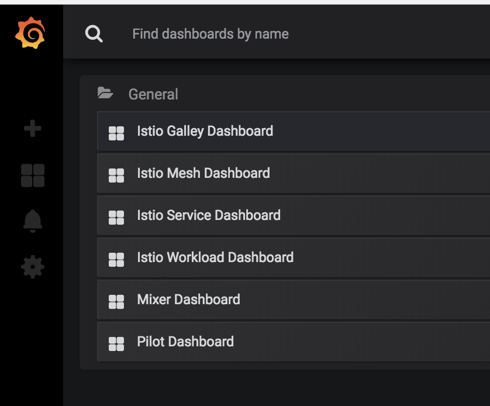

---


# Istio Lab

In recent years, with the development of container technology, more enterprise customers are turning to microservices. Microservices are a combination of lightweight and fine-grained services that work cohesively to allow for larger, application-wide functionality. This approach improves modularity and makes applications easier to develop and test when compared to traditional, monolithic application. With the adoption of microservices, new challenges emerge due to a myriad of services that exist in larger systems. Developers must now account for service discovery, load balancing, fault tolerance, dynamic routing, and communication security. Thanks to Istio, we can turn disparate microservices into an integrated service mesh by systemically injecting envoy proxy into the network layers while decoupling the operators to connect, manage, and secure microservices for application feature development.

This lab takes you step-by-step through the installation of Istio and the deployment of microservices-based applications in IBM Cloud Private.

> **Prerequisites** : you should be logged on your VM and connected to your ICP master.


# Introduction

This example deploys a sample application composed of four separate microservices used to demonstrate various Istio features. The application displays information about a book, similar to a single catalog entry of an online book store. Displayed on the page is a description of the book, book details (ISBN, number of pages, and so on), and a few book reviews.

The Bookinfo application is broken into four separate microservices:

- `productpage`. The `productpage` microservice calls the `details` and `reviews` microservices to populate the page.
- `details`. The `details` microservice contains book information.
- `reviews`. The `reviews` microservice contains book reviews. It also calls the `ratings` microservice.
- `ratings`. The `ratings` microservice contains book ranking information that accompanies a book review.

There are 3 versions of the `reviews` microservice:

- Version v1 doesn’t call the `ratings` service.
- Version v2 calls the `ratings` service, and displays each rating as 1 to 5 black stars.
- Version v3 calls the `ratings` service, and displays each rating as 1 to 5 red stars.

To run the sample with Istio requires no changes to the application itself. Instead, we simply need to configure and run the services in an Istio-enabled environment, with Envoy sidecars injected along side each service. The needed commands and configuration vary depending on the runtime environment although in all cases the resulting deployment will look like this:


# Task 1: Configuring Istio on IBM Cloud Private 

Istio has been normally **installed** during your IBM Cloud Private installation (parameter "istio: enabled" in the config.yaml). You can also install istio after the IBM Cloud Private installation by using the Helm Catalog.

Be sure you are connected to your environment by using the cloudctl:

```bash
source icpinit

cloudctl login -a https://$CLUSTERNAME.icp:8443 --skip-ssl-validation -u admin -p $CLUSTERPASS -n default
```

An `istio-system` namespace with the `ibm-privileged-psp` has been already created to support ISTIO.

```bash
kubectl get namespaces
```

Results:

```bash
# kubectl get namespaces
NAME           STATUS   AGE
cert-manager   Active   20h
default        Active   20h
ibmcom         Active   20h
icp-system     Active   20h
istio-system   Active   20h
kube-public    Active   20h
kube-system    Active   20h
services       Active   19h
```

Istio **version 1.2.2**  has been already installed for this lab. 

Ensure that the `istio-*` Kubernetes services are deployed before you continue.

```bash
kubectl get svc -n istio-system
```
Output:

```console
# kubectl get svc -n istio-system
NAME                     TYPE           CLUSTER-IP     EXTERNAL-IP   PORT(S)                                                                                                                                      AGE
grafana                  ClusterIP      10.0.234.21    <none>        3000/TCP                                                                                                                                     19h
istio-citadel            ClusterIP      10.0.101.204   <none>        8060/TCP,15014/TCP                                                                                                                           19h
istio-galley             ClusterIP      10.0.51.82     <none>        443/TCP,15014/TCP,9901/TCP                                                                                                                   19h
istio-grafana-svc        NodePort       10.0.239.221   <none>        3000:31453/TCP                                                                                                                               10h
istio-ingressgateway     LoadBalancer   10.0.61.211    <pending>     15020:32391/TCP,80:31380/TCP,443:31390/TCP,31400:31400/TCP,15029:31960/TCP,15030:30245/TCP,15031:30565/TCP,15032:30601/TCP,15443:31220/TCP   19h
istio-kiali              NodePort       10.0.247.223   <none>        20001:30368/TCP                                                                                                                              10h
istio-pilot              ClusterIP      10.0.68.248    <none>        15010/TCP,15011/TCP,8080/TCP,15014/TCP                                                                                                       19h
istio-prometheus-svc     NodePort       10.0.176.229   <none>        9090:31151/TCP                                                                                                                               10h
istio-sidecar-injector   ClusterIP      10.0.88.179    <none>        443/TCP                                                                                                                                      19h
istio-telemetry          ClusterIP      10.0.71.206    <none>        9091/TCP,15004/TCP,15014/TCP,42422/TCP                                                                                                       19h
jaeger-agent             ClusterIP      None           <none>        5775/UDP,6831/UDP,6832/UDP                                                                                                                   19h
jaeger-collector         ClusterIP      10.0.219.187   <none>        14267/TCP,14268/TCP                                                                                                                          19h
jaeger-query             ClusterIP      10.0.123.68    <none>        16686/TCP                                                                                                                                    19h
kiali                    ClusterIP      10.0.106.145   <none>        20001/TCP                                                                                                                                    19h
prometheus               ClusterIP      10.0.230.241   <none>        9090/TCP                                                                                                                                     19h
tracing                  ClusterIP      10.0.193.226   <none>        80/TCP                                                                                                                                       19h
zipkin                   ClusterIP      10.0.227.20    <none>        9411/TCP    
```
  **Note: the istio-ingressgateway service will be in `pending` state with no external ip. That is normal.**

Ensure the corresponding pods `istio-citadel-*`, `istio-ingressgateway-*`, `istio-pilot-*`, and `istio-policy-*` are all in **`Running`** state before you continue.

```bash
kubectl get pods -n istio-system
```
Output:

```bash
# kubectl get pods -n istio-system
NAME                                     READY   STATUS    RESTARTS   AGE
grafana-7d4799d4c9-vwzq5                 1/1     Running   0          19h
istio-citadel-6dbc569d78-9nhv2           1/1     Running   0          19h
istio-galley-68df968dd9-c8wlc            1/1     Running   0          19h
istio-ingressgateway-d6f5fd859-p5nct     1/1     Running   8          19h
istio-pilot-67797475f6-9mjp7             2/2     Running   5          19h
istio-sidecar-injector-6887db4dd-2bq9r   1/1     Running   0          19h
istio-telemetry-6fdd465876-8lm6p         2/2     Running   8          19h
istio-tracing-c4749c699-bz8ks            1/1     Running   0          19h
kiali-79d85b75dd-jjxwz                   1/1     Running   0          19h
prometheus-db8b96479-2mfnn               1/1     Running   0          19h

```

These pods running in the istio-system namespace are part of the Istio control plane and you recognize the different names like **Citadel, Galley, Pilot, Telemetry** ... We just added a few more modules like **Grafana, Kiali and Prometheus** to add some graphical UIs to Istio. 

Before your continue, make sure all the pods are deployed and **`Running`**. If they're in `pending` state, wait a few minutes to let the deployment finish.


# Task 2 - Deploy the Bookinfo application
If the **control plane** is deployed successfully, you can then start to deploy your applications that are managed by Istio. I will use the **Bookinfo** application as an example to illustrate the steps of deploying applications that are managed by Istio.


### Download the BookInfo manifests

Because the Istio version is 1.2.2, we are going also to use the BookInfo application coming from the same version.

``` 
mkdir istio
cd istio
curl -L https://istio.io/downloadIstio | ISTIO_VERSION=1.2.2 TARGET_ARCH=x86_64 sh -
cd istio-1.2.2/
```

Results:

```bash
cd istio
[root@niceooom01 istio]# curl -L https://istio.io/downloadIstio | ISTIO_VERSION=1.2.2 TARGET_ARCH=x86_64 sh -
  % Total    % Received % Xferd  Average Speed   Time    Time     Time  Current
                                 Dload  Upload   Total   Spent    Left  Speed
100   102  100   102    0     0    132      0 --:--:-- --:--:-- --:--:--   132
100  4277  100  4277    0     0   4758      0 --:--:-- --:--:-- --:--:--  4758

Downloading istio-1.2.2 from https://github.com/istio/istio/releases/download/1.2.2/istio-1.2.2-linux.tar.gz ...
Istio 1.2.2 Download Complete!

Istio has been successfully downloaded into the istio-1.2.2 folder on your system.

Next Steps:
See https://istio.io/latest/docs/setup/install/ to add Istio to your Kubernetes cluster.

To configure the istioctl client tool for your workstation,
add the /root/istio/istio-1.2.2/bin directory to your environment path variable with:
	 export PATH="$PATH:/root/istio/istio-1.2.2/bin"

Begin the Istio pre-installation check by running:
	 istioctl x precheck 

Need more information? Visit https://istio.io/latest/docs/setup/install/ 
# cd istio-1.2.2

```


### Create a Secret

If you are using the ICP private registry for the sidecar image, then you need to create a Secret of type docker-registry in the cluster that holds authorization token, and patch it to your application’s ServiceAccount. Use the following 2 commands:

```bash 
kubectl -n default create secret docker-registry private-registry-key --docker-server=$CLUSTERNAME.icp:8500 --docker-username=admin --docker-password=$CLUSTERPASS --docker-email=null
```

For example:

```bash
kubectl -n default create secret docker-registry private-registry-key --docker-server=niceooo.icp:8500 --docker-username=admin --docker-password=niceooo- --docker-email=null
```

Then patch the service account:

```bash
kubectl -n default patch serviceaccount default -p '{"imagePullSecrets": [{"name": "private-registry-key"}]}'
```


### Prepare the Bookinfo manifest

We need to change the bookinfo.yaml manifest file to incorporate the private-registry-key.

Open the bookinfo.yaml manifest file:

```bash
nano samples/bookinfo/platform/kube/bookinfo.yaml
```

**Replace** the existing file with the one below (the only difference is the imagePullSecrets item):

``` yaml
# Copyright 2017 Istio Authors
#
#   Licensed under the Apache License, Version 2.0 (the "License");
#   you may not use this file except in compliance with the License.
#   You may obtain a copy of the License at
#
#       http://www.apache.org/licenses/LICENSE-2.0
#
#   Unless required by applicable law or agreed to in writing, software
#   distributed under the License is distributed on an "AS IS" BASIS,
#   WITHOUT WARRANTIES OR CONDITIONS OF ANY KIND, either express or implied.
#   See the License for the specific language governing permissions and
#   limitations under the License.

##################################################################################################
# Details service
##################################################################################################
apiVersion: v1
kind: Service
metadata:
  name: details
  labels:
    app: details
    service: details
spec:
  ports:
  - port: 9080
    name: http
  selector:
    app: details
---
apiVersion: v1
kind: ServiceAccount
metadata:
  name: bookinfo-details
---
apiVersion: apps/v1
kind: Deployment
metadata:
  name: details-v1
  labels:
    app: details
    version: v1
spec:
  replicas: 1
  selector:
    matchLabels:
      app: details
      version: v1
  template:
    metadata:
      labels:
        app: details
        version: v1
    spec:
      serviceAccountName: bookinfo-details
      containers:
      - name: details
        image: istio/examples-bookinfo-details-v1:1.12.0
        imagePullPolicy: IfNotPresent
        ports:
        - containerPort: 9080
      imagePullSecrets:
      - name: private-registry-key
---
##################################################################################################
# Ratings service
##################################################################################################
apiVersion: v1
kind: Service
metadata:
  name: ratings
  labels:
    app: ratings
    service: ratings
spec:
  ports:
  - port: 9080
    name: http
  selector:
    app: ratings
---
apiVersion: v1
kind: ServiceAccount
metadata:
  name: bookinfo-ratings
---
apiVersion: apps/v1
kind: Deployment
metadata:
  name: ratings-v1
  labels:
    app: ratings
    version: v1
spec:
  replicas: 1
  selector:
    matchLabels:
      app: ratings
      version: v1
  template:
    metadata:
      labels:
        app: ratings
        version: v1
    spec:
      serviceAccountName: bookinfo-ratings
      containers:
      - name: ratings
        image: istio/examples-bookinfo-ratings-v1:1.12.0
        imagePullPolicy: IfNotPresent
        ports:
        - containerPort: 9080
      imagePullSecrets:
      - name: private-registry-key
---
##################################################################################################
# Reviews service
##################################################################################################
apiVersion: v1
kind: Service
metadata:
  name: reviews
  labels:
    app: reviews
    service: reviews
spec:
  ports:
  - port: 9080
    name: http
  selector:
    app: reviews
---
apiVersion: v1
kind: ServiceAccount
metadata:
  name: bookinfo-reviews
---
apiVersion: apps/v1
kind: Deployment
metadata:
  name: reviews-v1
  labels:
    app: reviews
    version: v1
spec:
  replicas: 1
  selector:
    matchLabels:
      app: reviews
      version: v1
  template:
    metadata:
      labels:
        app: reviews
        version: v1
    spec:
      serviceAccountName: bookinfo-reviews
      containers:
      - name: reviews
        image: istio/examples-bookinfo-reviews-v1:1.12.0
        imagePullPolicy: IfNotPresent
        ports:
        - containerPort: 9080
      imagePullSecrets:
      - name: private-registry-key
---
apiVersion: apps/v1
kind: Deployment
metadata:
  name: reviews-v2
  labels:
    app: reviews
    version: v2
spec:
  replicas: 1
  selector:
    matchLabels:
      app: reviews
      version: v2
  template:
    metadata:
      labels:
        app: reviews
        version: v2
    spec:
      serviceAccountName: bookinfo-reviews
      containers:
      - name: reviews
        image: istio/examples-bookinfo-reviews-v2:1.12.0
        imagePullPolicy: IfNotPresent
        ports:
        - containerPort: 9080
      imagePullSecrets:
      - name: private-registry-key
---
apiVersion: apps/v1
kind: Deployment
metadata:
  name: reviews-v3
  labels:
    app: reviews
    version: v3
spec:
  replicas: 1
  selector:
    matchLabels:
      app: reviews
      version: v3
  template:
    metadata:
      labels:
        app: reviews
        version: v3
    spec:
      serviceAccountName: bookinfo-reviews
      containers:
      - name: reviews
        image: istio/examples-bookinfo-reviews-v3:1.12.0
        imagePullPolicy: IfNotPresent
        ports:
        - containerPort: 9080
      imagePullSecrets:
      - name: private-registry-key
---
##################################################################################################
# Productpage services
##################################################################################################
apiVersion: v1
kind: Service
metadata:
  name: productpage
  labels:
    app: productpage
    service: productpage
spec:
  ports:
  - port: 9080
    name: http
  selector:
    app: productpage
---
apiVersion: v1
kind: ServiceAccount
metadata:
  name: bookinfo-productpage
---
apiVersion: apps/v1
kind: Deployment
metadata:
  name: productpage-v1
  labels:
    app: productpage
    version: v1
spec:
  replicas: 1
  selector:
    matchLabels:
      app: productpage
      version: v1
  template:
    metadata:
      labels:
        app: productpage
        version: v1
    spec:
      serviceAccountName: bookinfo-productpage
      containers:
      - name: productpage
        image: istio/examples-bookinfo-productpage-v1:1.12.0
        imagePullPolicy: IfNotPresent
        ports:
        - containerPort: 9080
      imagePullSecrets:
      - name: private-registry-key
---
```

**Save** the file with Ctrl+o and Ctrl+x in nano. 


### Automatic Sidecar Injection

We have enabled automatic sidecar injection, so the istio-sidecar-injector automatically injects Envoy **proxy** containers into your **application pods** that are running in the namespaces, labelled with istio-injection=enabled. 

Let's deploy the Bookinfo application to the **default** namesapce. To enable automatic proxy injection, type the following command (this is just a label associated to the default namespace):

```bash
kubectl label namespace default istio-injection=enabled
```

Then add an image policy. To add a <u>Cluster Image Policy</u>, go to the **Menu > Manage > Resource Security**


Now let's add a new policy for our LDAP image and click on the **Create Image Policy**:

Fill the name field with **istio-policy** 

Then click **add a registry policy** and type the following entries :

```yaml
docker.io/istio*
docker.io/istio/*
$CLSUTERNAME.icp:8500/*
$CLUSTERNAME.icp:8500/ibmcom/*
```


(of course replace **$CLUSTERNAME** with your cluster name)

Finish by clicking **Create** at the top right.


The policy will be saved. 

Now, here is the command to deploy the application (and inject automatically the sidecar:

``` bash
kubectl apply -f samples/bookinfo/platform/kube/bookinfo.yaml
```


Results:

```bash
# kubectl apply -f samples/bookinfo/platform/kube/bookinfo.yaml
service/details created
serviceaccount/bookinfo-details created
deployment.apps/details-v1 created
service/ratings created
serviceaccount/bookinfo-ratings created
deployment.apps/ratings-v1 created
service/reviews created
serviceaccount/bookinfo-reviews created
deployment.apps/reviews-v1 created
deployment.apps/reviews-v2 created
deployment.apps/reviews-v3 created
service/productpage created
serviceaccount/bookinfo-productpage created
deployment.apps/productpage-v1 created
```


To check that the injection was successful, go to ICP console, click on the **Menu>Workload>Deployments**


It can take one minute. Ensure that all the pods (microservices) are running:

```bash
# kubectl get pods 
NAME                             READY   STATUS    RESTARTS   AGE
details-v1-6d88ccb48d-kfp2x      2/2     Running   0          116s
productpage-v1-694ffbdf8-fwbbr   2/2     Running   0          113s
ratings-v1-87b99b88-vtkgl        2/2     Running   0          116s
reviews-v1-786b96f9cc-hqnv4      2/2     Running   0          116s
reviews-v2-55d7b585b9-4z4kd      2/2     Running   0          115s
reviews-v3-6dffb778f7-52vj2      2/2     Running   0          114s
```


From the ICP console, go to **productpage** deployment, then **drill down to POD** and then **drill down to containers.** You should have 2 containers in one POD. The istio-proxy is the side-car container running aside the application container. 


### Check that the application is running

```bash
kubectl exec "$(kubectl get pod -l app=ratings -o jsonpath='{.items[0].metadata.name}')" -c ratings -- curl productpage:9080/productpage | grep -o "<title>.*</title>"
```

Results (you will see the following lines):

```bash
# kubectl exec "$(kubectl get pod -l app=ratings -o jsonpath='{.items[0].metadata.name}')" -c ratings -- curl productpage:9080/productpage | grep -o "<title>.*</title>"
  % Total    % Received % Xferd  Average Speed   Time    Time     Time  Current
                                 Dload  Upload   Total   Spent    Left  Speed
100  3889  100  3889    0     0    639      0  0:00:06  0:00:06 --:--:--   798
<title>Simple Bookstore App</title>
```


### Install a Gateway

Now that the Bookinfo services are up and running, you need to make the application accessible from outside of your Kubernetes cluster, e.g., from a browser. An [Istio Gateway](https://istio.io/docs/concepts/traffic-management/#gateways) is used for this purpose.

```bash
kubectl apply -f samples/bookinfo/networking/bookinfo-gateway.yaml
```

Results (a Gateway and a virtual service are created)

```bash
kubectl apply -f samples/bookinfo/networking/bookinfo-gateway.yaml
gateway.networking.istio.io/bookinfo-gateway created
virtualservice.networking.istio.io/bookinfo created
```

Check the **Gateway**:

```bash
kubectl get gateway
```

Results:

```
kubectl get gateway
NAME               AGE
bookinfo-gateway   13s
```


### Define Ports and URLs 

Define the following variables for ports:

```bash
export INGRESS_PORT=$(kubectl -n istio-system get service istio-ingressgateway -o jsonpath='{.spec.ports[?(@.name=="http2")].nodePort}')
export SECURE_INGRESS_PORT=$(kubectl -n istio-system get service istio-ingressgateway -o jsonpath='{.spec.ports[?(@.name=="https")].nodePort}')
export TCP_INGRESS_PORT=$(kubectl -n istio-system get service istio-ingressgateway -o jsonpath='{.spec.ports[?(@.name=="tcp")].nodePort}')
```

Check the ingress port:

```bash
echo $INGRESS_PORT
```

As an example:

```bash
# echo $INGRESS_PORT
31380
```

Define the Host in a variable:

```bash
export INGRESS_HOST=$(kubectl get po -l istio=ingressgateway -n istio-system -o jsonpath='{.items[0].status.hostIP}')
```

As a result example:

```bash
# echo $INGRESS_HOST
158.176.128.251
```

So the Gateway URL should be:

```bash
export GATEWAY_URL=$INGRESS_HOST:$INGRESS_PORT
```

And the expected result is :

```bash
# echo $GATEWAY_URL
158.176.128.251:31380
```


# Task3: Access the Bookinfo application

After all pods for the Bookinfo application are in a running state and the gateway has been created,  you can access the Bookinfo **product page**. 


```bash
curl -s "http://${GATEWAY_URL}/productpage" | grep -o "<title>.*</title>"
```

Results (you should see **Simple Book Store**)

``` bash
# curl -s "http://${GATEWAY_URL}/productpage" | grep -o "<title>.*</title>"
<title>Simple Bookstore App</title>
```


### Add Destination Rules

```bash
kubectl apply -f samples/bookinfo/networking/destination-rule-all.yaml
```

Results

```bash
# kubectl apply -f samples/bookinfo/networking/destination-rule-all.yaml
destinationrule.networking.istio.io/productpage created
destinationrule.networking.istio.io/reviews created
destinationrule.networking.istio.io/ratings created
destinationrule.networking.istio.io/details created
```


### See Bookinfo in a browser

Open a browser and type the Gateway URL

```http
http://${GATEWAY_URL}/productpage
```


Try to refresh the page several times, you will see different versions of reviews **randomly** shown in the product page(red stars, black stars, no stars), because I haven’t created any route rule for the Bookinfo application.


# Task 4: Collect Metrics with Prometheus

In this section, you can see how to configure Istio to automatically gather telemetry and create new customized telemetry for services. I will use the Bookinfo application as an example.

Istio can enable Prometheus with a service type of ClusterIP. You can also expose another service of type NodePort and then access Prometheus by running the following command:

```bash
kubectl expose service prometheus --type=NodePort  --name=istio-prometheus-svc --namespace istio-system
```


```bash
export PROMETHEUS_URL=$(kubectl get po -l app=prometheus \
      -n istio-system -o 'jsonpath={.items[0].status.hostIP}'):$(kubectl get svc \
      istio-prometheus-svc -n istio-system -o 'jsonpath={.spec.ports[0].nodePort}')
```

Check the results:

`echo http://${PROMETHEUS_URL}/ `       

Results:
```console
# echo http://${PROMETHEUS_URL}/
http://5.10.96.73:31316/
```

Use the ${PROMETHEUS_URL} to get access to prometheus from a browser.

```http
http://5.10.96.73:31316/
```


Then type `istio_response_bytes_sum` in the first field and click execute button:


Move to the right to see the collected metrics:


If you don't see anything (no metrics yet collected), then retry the following command several times in the terminal:

```bash
curl -o /dev/null -s -w "%{http_code}\n" http://<masterip>:9080/productpage
```


# Task 5: Visualizing Metrics with Grafana

Now I will setup and use the Istio Dashboard to monitor the service mesh traffic. I will use the Bookinfo application as an example.

Similar to Prometheus, Istio enables Grafana with a service type of ClusterIP. You need to expose another service of type NodePort to access Grafana from the external environment by running the following commands:

```bash
kubectl expose service grafana --type=NodePort --name=istio-grafana-svc --namespace istio-system
```

Then export a variable:

```bash
export GRAFANA_URL=$(kubectl get po -l app=grafana -n \
      istio-system -o 'jsonpath={.items[0].status.hostIP}'):$(kubectl get svc \
      istio-grafana-svc -n istio-system -o \
      'jsonpath={.spec.ports[0].nodePort}')
```

Finally:

`echo http://${GRAFANA_URL}/`

Results:
```console
# echo http://${GRAFANA_URL}
http://5.10.96.73:30915
```
Access the Grafana web page from your browser http://${GRAFANA_URL}/.

```http
http://5.10.96.73:30915
```

By default, Istio grafana has some built-in dashboards: Istio Dashboard, Mixer Dashboard and Pilot Dashboard. Istio Mesh Dashboard is an overall view for all service traffic including high-level HTTP requests flowing and metrics about each individual service call, while Mixer Dashboard and Pilot Dashboard are mainly resources usage overview.

Click on the top left HOME button and you should see all the built-in dashboards:



The Istio Mesh Dashboard resembles the following screenshot (refresh the productpage screen) :


 Navigate into the different views:

     


# Task 6: Topologies with Kiali

Kiali is another open-source solution that can help to visualize the microservices topology.

Similar to the other solutions, we are going to expose and export a service :

``` bash
kubectl expose service kiali --type=NodePort --name=istio-kiali --namespace istio-system
```

Results:

```bash
# kubectl expose service kiali --type=NodePort --name=istio-kiali --namespace istio-system
service/istio-kiali exposed
```

Define a variable:

```bash 
export KIALI_URL=$(kubectl get po -l app=kiali -n istio-system -o 'jsonpath={.items[0].status.hostIP}'):$(kubectl get svc istio-kiali -n istio-system -o 'jsonpath={.spec.ports[0].nodePort}')
```

Define the URL

```bash
#  echo http://${KIALI_URL}/
http://158.176.128.251:30368/
```


Open a browser and look at the **Graph** view to see the topology (you will need to refresh Bookinfo several times before you can see some activity) - Also take the last 10 mn


Then you may see some issues:


# Congratulations 

You have successfully installed, deployed and customized the **Istio** for an **IBM Cloud Private** cluster.

In this lab, we have enabled Istio on an IBM Cloud Private 3.2.  We also reviewed how to deploy microservice-based application that are managed and secured by Istio. The lab also covered how to manage and monitor microservices with Istio addons such as Prometheus and Grafana.

Istio solves the microservices mesh tangle challenge by injecting a transparent envoy proxy as a sidecar container to application pods. Istio can collect fine-grained metrics and dynamically modify the routing flow without interfering with the original application. This provides a uniform way to connect, secure, manage, and monitor microservices.

For more information about Istio, see https://istio.io/docs/.

----


