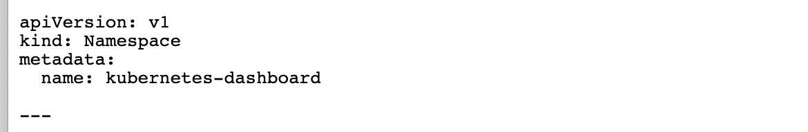
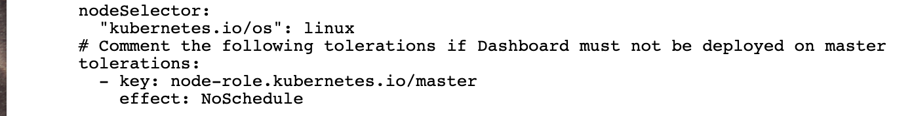
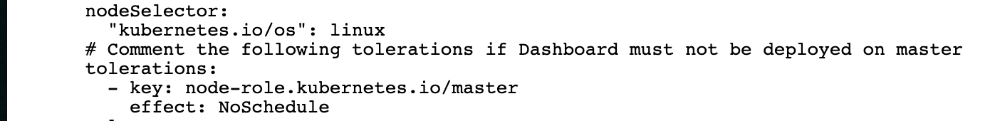
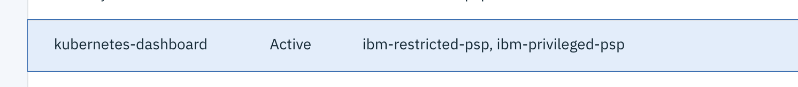
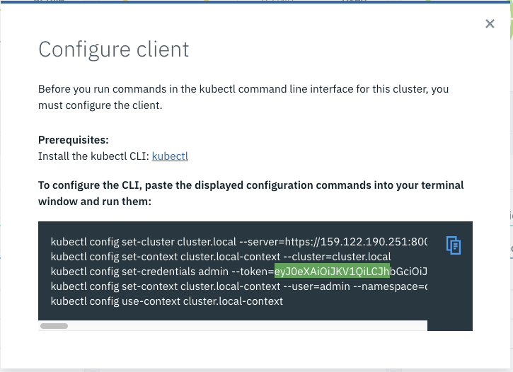
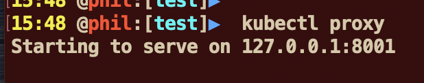
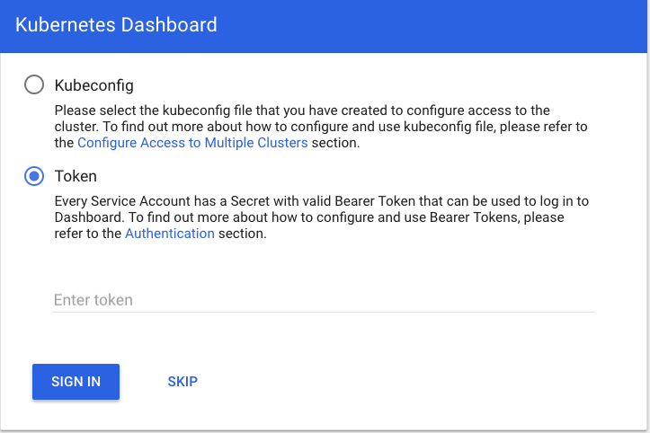
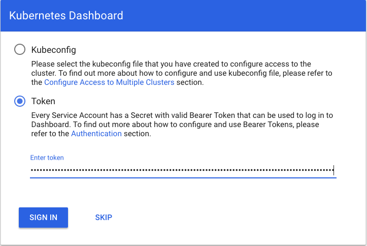
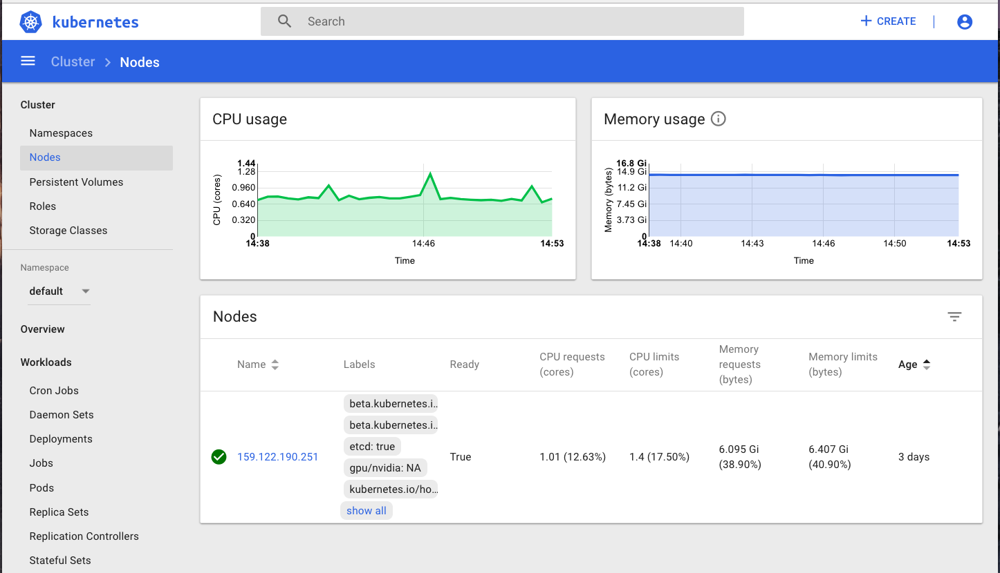
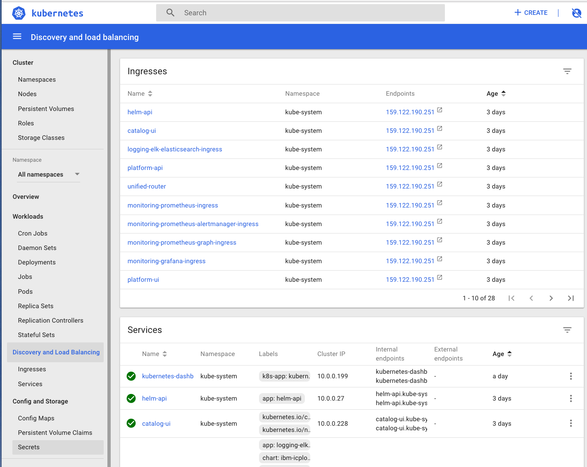

---
# Dashboard Lab
This lab is compatible with ICP version 3.2.1


This lab is compatible with ICP version 3.1


**Kubernetes Dashboard** is a general purpose, web-based UI for Kubernetes clusters. It allows users to manage applications running in the cluster and troubleshoot them, as well as manage the cluster itself.

The purpose of this lab is to install the dashboard in the IBM Cloud Private Cluster that we already created. 

> **Prerequisites** : you should be logged on your VM and connected to your ICP master.


---


# Task 1: Download the manifest file

Connect to the **master node VM** with your credentials.

Be sure you are connected to your environment by using the **cloudctl**:

```bash
source icpinit

cloudctl login -a https://$CLUSTERNAME.icp:8443 --skip-ssl-validation -u admin -p $CLUSTERPASS -n default
```


To see the latest version of the **Kubernetes Dashboard**, you can get it on the following link :

https://github.com/kubernetes/dashboard

And then download the deployment file, follow the steps:

```bash
mkdir dash
cd dash

wget https://raw.githubusercontent.com/kubernetes/dashboard/master/aio/deploy/recommended.yaml
```

As a result, you get a file call **recommended.yaml** file:

```bash
# ll
total 8
-rw-r--r--. 1 root root 7009 Sep 30 07:56 recommended.yaml
```


# Task 2: Modify the manifest file


Edit this file using nano or vi:

```bash
nano recommended.yaml 
```

In this file, remove some sections using Ctrl+k in nano:

- Remove the namespace definition section: 



- Remove the nodeSelector and tolerations sections at the end of the first deployment:



- Remove the nodeSelector and tolerations sections at the end of the second deployment:




Be careful : do not insert any tab in the file. 

**Save** your file using Ctrl+o and Ctrl+x


# Task 3: Deploy the Dashboard

Go to the ICP Dashboard, go to **Menu > Manage > Namespaces**

Create a new namespace called **kubernetes-dashboard** with **ibm-privileged-psp** like this:



Then deploy the dashboard :

`kubectl create -f recommended.yaml ` 

Results :

```console 
...
secret "kubernetes-dashboard-certs" created
serviceaccount "kubernetes-dashboard" created
role.rbac.authorization.k8s.io "kubernetes-dashboard-minimal" created
rolebinding.rbac.authorization.k8s.io "kubernetes-dashboard-minimal" created
deployment.apps "kubernetes-dashboard" created
service "kubernetes-dashboard" created
```
Use the following command to check that the POD is running :

`kubectl get deploy kubernetes-dashboard -n kubernetes-dashboard`

Results :
```bash
# kubectl get deploy kubernetes-dashboard -n kubernetes-dashboard
NAME                   READY   UP-TO-DATE   AVAILABLE   AGE
kubernetes-dashboard   1/1     1            1           71m
```


# Task 4: Connect to the Dashboard

First step, you should get your **token** from the IBM Cloud Private console :
- go to your admin profile (top right hand)
- click on **configure client**



> Take a note (copy) of the very long string corresponding to the **admin token**.


To connect to the kubernetes dashboard, we use the kubectl proxy technic. 

Go to your laptop, install the **cloudctl** and **kubectl** command CLIs:

Be sure that you used the **cloudctl** to be connected to your cluster.

```bash
cloudctl login -a https://$CLUSTERNAME.icp:8443 --skip-ssl-validation -u admin -p $CLUSTERPASS -n default
```


```bash
kubectl proxy
```

Results (the command will open a tunnel to connect from your laptop to your connacted cluster)




Use the following URL to get connected to the Kubernetes Dashboard on **your laptop **in a browser :

```http
https://127.0.0.1:8001
```


The following screen should appear (select **token**):




Click on token radio button and paste your **token**. 




The Kubernetes **Dashboard** should appear :




# Task 6: Navigate in the Dashboard

Navigate on the left pane :
- Nodes
- Persistent volumes
- Namespace section, choose the **All Namespaces**
- Deployments
- Pods
- Discovery and Load Balancing





# Congratulations 

You have successfully installed, deployed and customized the Kubernetes Dashboard for an **IBM Cloud Private** cluster.


